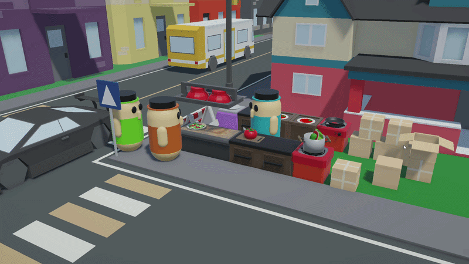
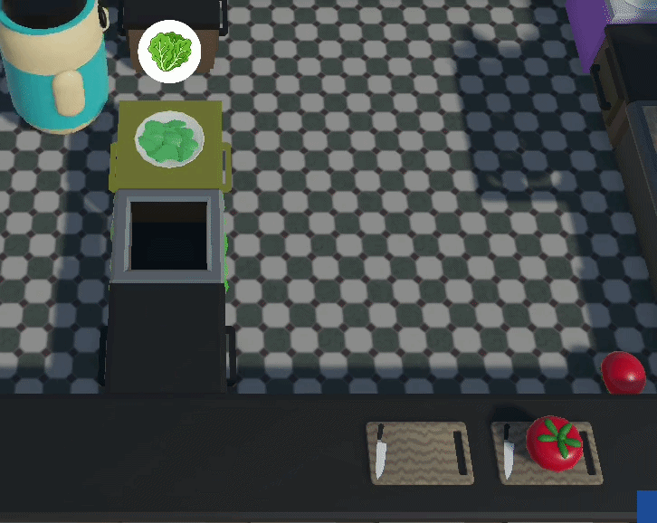
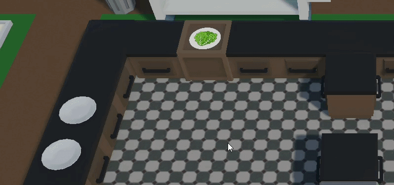
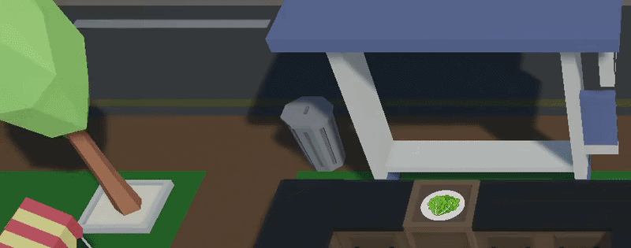
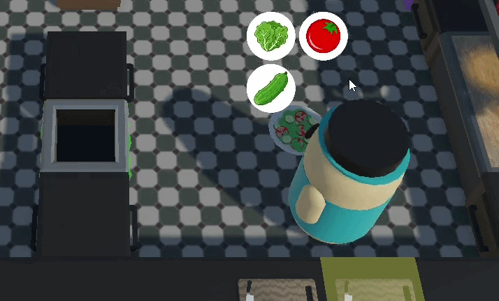

# Overcooked
Fast-paced singleplayer (for now) cooking game with handcrafted 3D assets and physics-driven interactions. Game heavly inspired by Overcooked game.

### Highlights

Implemented mechanics:
- Cutting food
- Throwing items with snapping on counters
- Limited time orders
- Points combo multiplier for serving orders in good order
- Clients waiting for orders
- Animated start screen

### How to play

Download latest version from releases page (on the right).
Game compiled on Windows 11.
Required space: 140MB (v.0.1)

Don't forget to look down for the controls.

### Used software

- Unity 6.3 LTS
- Blender 5.1.0
- Gimp (for textures, images)

### Art & assets

The 3D models used in this game were mostly created by hand in Blender. Exceptions are some background scene elements.

Stworzone obiekty: Counter, Cutting board, Ingredient box, Bin, Serving counter, Sink, Gas stove, Plate dispenser, Cooking pot, Frying pan, Plate, Player, Salad (whole, sliced, on plate), Tomato (whole, sliced, on plate), Cucumber (whole, sliced, on plate).

Some textures were generated by AI because I'm a poor artist.

### Implemented game elements

**Elements**:
- Scenes: Main screen, Level 1
- UI elements: main menu, pause, end-of-game screen, score display, remaining time, current orders, cutting status, product icon, icons for products on the plate
- Food: lettuce, tomato, cucumber (in whole, sliced, and on-plate versions)
- Mechanics: carrying items on a plate, recipes and recipe book, customers waiting for orders, main menu animation, scoring system and score multiplier, item states, placing/picking items on counters, throwing items, highlighting interactable elements, automatic attraction of thrown items to counters
- Interactive counters: Counter, CuttingStation, Bin, IngredientBox, PlateDispenser, ServiceCounter
- Global game settings

### Controls

The game fully supports both keyboard & mouse and controllers:

| Action | Keyboard | Controller (XInput) |
| :----- | :------: | :-----------------: |
| Movement | WSAD / Arrows | Left Stick |
| Grab / Put | Space | A |
| Cut / Throw | F | X |
| Pause | Esc | Start |

### Used assets from Asset Store:

- [Low Poly Simple Urban City 3D Asset Pack v.1.0.0](https://assetstore.unity.com/packages/3d/environments/urban/free-low-poly-simple-urban-city-3d-asset-pack-239474) by Draftpunk Studios
- [Match 3d Object Pack: Fruits & Vegetables v.1.0](https://assetstore.unity.com/packages/3d/props/food/match-3d-object-pack-fruits-vegetables-284706) by ThreeBox

### Future goals

- local co-op,
- gas stove mechanic with cooking pot and frying pan,
- fire mechanic with fire extinguisher,
- cleaning dirty plates in sink,
- forward boost for player,
- more levels (with more dishes) with interactive parts and moving elements,
- respawn mechanic,
- better player model with animations.
